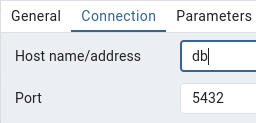

# Homework 1
## Question 1
### Run docker with the python:3.12.8 image in an interactive mode, use the entrypoint bash. What's the version of pip in the image?
```bash
[dmadmin@devlabsvr05 ~]$ docker run -it --entrypoint=bash python:3.12.8
```
```bash
root@850f603156b6:/# pip --version
pip 24.3.1 from /usr/local/lib/python3.12/site-packages/pip (python 3.12)
```
## Question 2
### Given the following docker-compose.yaml, what is the hostname and port that pgadmin should use to connect to the postgres database?
```bash
[dmadmin@devlabsvr05 homework1-2]$ docker compose up -d
[+] Running 3/3
 ✔ Network homework1-2_default  Created                                                                                                                                                          0.3s 
 ✔ Container pgadmin            Started                                                                                                                                                          0.4s 
 ✔ Container postgres           Started                                                                                                                                                          0.4s 
[dmadmin@devlabsvr05 homework1-2]$ docker ps
CONTAINER ID   IMAGE                   COMMAND                  CREATED          STATUS          PORTS                                              NAMES
88c7dbfc7fd0   postgres:17-alpine      "docker-entrypoint.s…"   28 seconds ago   Up 28 seconds   0.0.0.0:5433->5432/tcp, [::]:5433->5432/tcp        postgres
45adb33badd7   dpage/pgadmin4:latest   "/entrypoint.sh"         28 seconds ago   Up 28 seconds   443/tcp, 0.0.0.0:8080->80/tcp, [::]:8080->80/tcp   pgadmin
```


## Question 3
### During the period of October 1st 2019 (inclusive) and November 1st 2019 (exclusive), how many trips, respectively, happened: 
1. Up to 1 mile
2. In between 1 (exclusive) and 3 miles (inclusive),
3. In between 3 (exclusive) and 7 miles (inclusive),
4. In between 7 (exclusive) and 10 miles (inclusive),
5. Over 10 miles

Used the *compose.yaml* to create PostgreSQL and pgAdmin containers and **ny_taxi** database.

Used the *ingest_data.py* created based on the course videos to create and populate the **green_taxi_data** table
```bash
[dmadmin@devlabsvr05 homework1-2]$ python ingest_data.py --user dmadmin --password dmadmin --host localhost --port 5432 --database ny_taxi --table green_taxi_data --url https://github.com/DataTalksClub/nyc-tlc-data/releases/download/green/green_tripdata_2019-10.csv.gz
```
Used the *create_zone_table.ipynb* created based on the course videos to create and populate the **zones** table.

```sql
SELECT count(1)
FROM green_taxi_data 
WHERE trip_distance <= 1.00
AND lpep_pickup_datetime >= date '2019-10-01 00:00:00'
AND lpep_dropoff_datetime < date '2019-11-01 00:00:00';
-- 1) 104802

SELECT count(1)
FROM green_taxi_data 
WHERE trip_distance > 1.00 AND trip_distance <= 3.00
AND lpep_pickup_datetime >= date '2019-10-01 00:00:00'
AND lpep_dropoff_datetime < date '2019-11-01 00:00:00';
-- 2) 198924

SELECT count(1)
FROM green_taxi_data 
WHERE trip_distance > 3.00 AND trip_distance <= 7.00
AND lpep_pickup_datetime >= date '2019-10-01 00:00:00'
AND lpep_dropoff_datetime < date '2019-11-01 00:00:00';
-- 3) 109603

SELECT count(1)
FROM green_taxi_data 
WHERE trip_distance > 7.00 AND trip_distance <= 10.00
AND lpep_pickup_datetime >= date '2019-10-01 00:00:00'
AND lpep_dropoff_datetime < date '2019-11-01 00:00:00';
-- 4) 27678

SELECT count(1)
FROM green_taxi_data 
WHERE trip_distance > 10.00
AND lpep_pickup_datetime >= date '2019-10-01 00:00:00'
AND lpep_dropoff_datetime < date '2019-11-01 00:00:00';
-- 5) 35189
```
## Question 4
### Which was the pick up day with the longest trip distance? Use the pick up time for your calculations.
### Tip: For every day, we only care about one single trip with the longest distance.

```SQL
SELECT lpep_pickup_datetime, trip_distance FROM green_taxi_data DATA
WHERE trip_distance IN (SELECT MAX(trip_distance) FROM green_taxi_data);
-- Pickup Date/Time: 2019-10-31 23:23:41 Trip ended on 2019-11-01 but question said to use pickup time for calculations
-- Max Trip Distance for Day by Pickup Time: 515.89
-- 2019-10-31

SELECT t1.index, t1.lpep_pickup_datetime, t1.lpep_dropoff_datetime, t1.trip_distance FROM green_taxi_data t1
JOIN (
  SELECT lpep_pickup_datetime, MAX(trip_distance) AS max_trip_distance
  FROM green_taxi_data
  GROUP BY lpep_pickup_datetime
) t2
ON t1.lpep_pickup_datetime=t2.lpep_pickup_datetime AND t1.trip_distance=t2.max_trip_distance
ORDER BY t1.trip_distance DESC;
```
## Question 5
### Which were the top pickup locations with over 13,000 in total_amount (across all trips) for 2019-10-18?
### Consider only lpep_pickup_datetime when filtering by date.

```sql
SELECT 
trip."PULocationID", 
zone."Zone", 
ROUND(SUM(trip."total_amount")::numeric, 2) sum_total_amount
FROM green_taxi_data trip, zones zone
WHERE 
trip.lpep_pickup_datetime >= date '2019-10-18 00:00:00' AND
trip.lpep_pickup_datetime < date '2019-10-19 00:00:00' AND
trip."PULocationID" = zone."LocationID"
GROUP BY trip."PULocationID", zone."Zone"
HAVING sum(trip."total_amount") > 13000.00

-- 75	"East Harlem South"	16797.26
-- 74	"East Harlem North"	18686.68
-- 166	"Morningside Heights"	13029.79
```
## Question 6
### For the passengers picked up in October 2019 in the zone named "East Harlem North" which was the drop off zone that had the largest tip?
### Note: it's tip , not trip
### We need the name of the zone, not the ID.
```sql
SELECT 
trip."DOLocationID", 
dozone."Zone", 
MAX(trip."tip_amount")
FROM green_taxi_data trip, zones puzone, zones dozone
WHERE 
trip.lpep_pickup_datetime >= date '2019-10-01 00:00:00' AND
trip.lpep_pickup_datetime < date '2019-11-01 00:00:00' AND
trip."DOLocationID" = dozone."LocationID" AND
trip."PULocationID" = puzone."LocationID" AND
puzone."Zone" = 'East Harlem North'
GROUP BY trip."DOLocationID", dozone."Zone"
ORDER BY 3 DESC
LIMIT 1

-- 132	"JFK Airport"	87.3
```
## Question 7
### Which of the following sequences, respectively, describes the workflow for:
1. Downloading the provider plugins and setting up backend,
2. Generating proposed changes and auto-executing the plan
3. Remove all resources managed by terraform

`terraform import` is for importing existing infrastructure with a Terraform resource. `terraform run` and `terraform rm` do not appear to be valid commands. 

Successfully executed:
1. `terraform init`
2. `terraform apply -auto-approve`
3. `terraform detroy`
