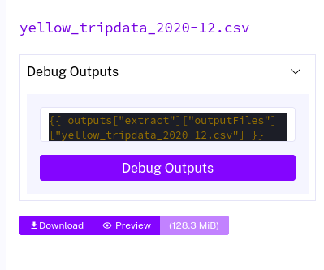
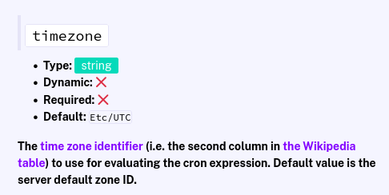
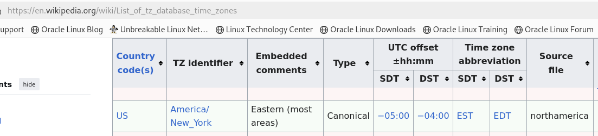

# Homework 2
## Adding 2021 Data for Green and Yellow Taxis
### Postgres
I modified the provided Kestra yaml and added `2021` to the list of values for processing month by month.
```yaml
  - id: year
    type: SELECT
    displayName: Select year
    values: ["2019", "2020", "2021"]
    defaults: "2019"
```
### BigQuery
I used the provided GCP Scheduled Kestra yaml and backfilled 2021-01-01 to 2021-07-31.
## Question 1
### Within the execution for Yellow Taxi data for the year 2020 and month 12: what is the uncompressed file size (i.e. the output file yellow_tripdata_2020-12.csv of the extract task)?
`128.3 MB`
Kestra output file from the `extract` task.

## Question 2
### What is the rendered value of the variable file when the inputs taxi is set to green, year is set to 2020, and month is set to 04 during execution?
`green_tripdata_2020-04.csv`. The `file` variable for month/year input is defined as:
```
file: "{{inputs.taxi}}_tripdata_{{inputs.year}}-{{inputs.month}}.csv"
```
for scheduled is defined as:
```
file: "{{inputs.taxi}}_tripdata_{{trigger.date | date('yyyy-MM')}}.csv"
```
## Question 3
### How many rows are there for the Yellow Taxi data for all CSV files in the year 2020?
`24,648,499`
```sql
SELECT COUNT(1) FROM `dez2025-kestra-mod2.zoomcamp_bigquery.yellow_tripdata` WHERE filename LIKE 'yellow_tripdata_2020-%';

-- 24648499
```
## Question 4
### How many rows are there for the Green Taxi data for all CSV files in the year 2020?
`1,723,051`
```sql
SELECT COUNT(1) FROM `dez2025-kestra-mod2.zoomcamp_bigquery.green_tripdata` WHERE filename LIKE 'green_tripdata_2020-%';

-- 1734051
```
## Question 5
### How many rows are there for the Yellow Taxi data for the March 2021 CSV file?
`1,925,152`
```SQL
SELECT COUNT(1) FROM yellow_tripdata WHERE filename='yellow_tripdata_2021-03.csv'

-- 1925152
```
```SQL
SELECT COUNT(1) FROM `dez2025-kestra-mod2.zoomcamp_bigquery.yellow_tripdata` WHERE filename='yellow_tripdata_2021-03.csv'
 
 -- 1925152
 ```
## Question 6
### How would you configure the timezone to New York in a Schedule trigger?
Add a `timezone` property set to `America/New_York` in the `Schedule` trigger configuration. Below compes from the Kestra `Schedule` help.


