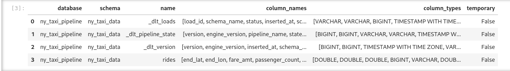
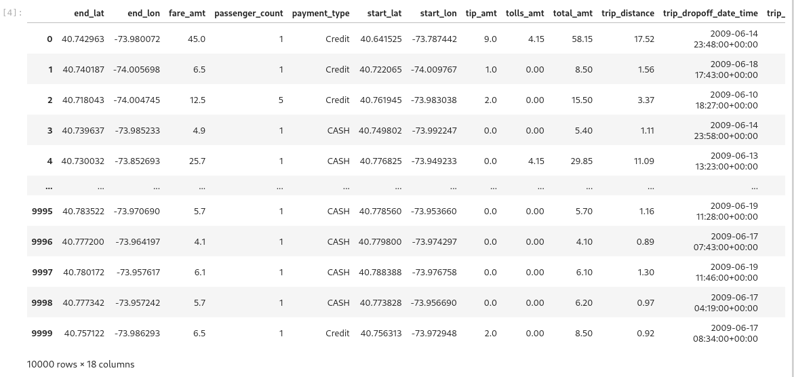
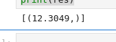

# Homework Workshop 1 - dlt
## Install dlt
`pip install dlt[duckdb]`
## Question 1
### What is dlt version?
```bash
[dmadmin@devlabsvr05 dez2025]$ dlt --version
dlt 1.6.1
```
**dlt 1.6.1**
## Question 2
### How many tables were created?
```python
import dlt
from dlt.sources.helpers.rest_client import RESTClient
from dlt.sources.helpers.rest_client.paginators import PageNumberPaginator

client = RESTClient(
    base_url="https://us-central1-dlthub-analytics.cloudfunctions.net",
    paginator=PageNumberPaginator(
        base_page=1,
        total_path=None
    )
)

@dlt.resource
def ny_taxi():
    for page in client.paginate("data_engineering_zoomcamp_api"):
        yield page

pipeline = dlt.pipeline(
    pipeline_name="ny_taxi_pipeline",
    destination="duckdb",
    dataset_name="ny_taxi_data"
)

load_info = pipeline.run(ny_taxi(), table_name="rides", write_disposition="replace")

print(load_info)
```
```python
import duckdb

conn = duckdb.connect("ny_taxi_pipeline.duckdb")

conn.sql("SET search_path = 'ny_taxi_data'")

conn.sql("DESCRIBE").df()
```


**4 Tables**
## Question 3
### What is the total number of records extracted?
```python
df = pipeline.dataset(dataset_type="default").rides.df()
df
```


**10,000 Records**
## Question 4
### Calculate the average trip duration in minutes.
```python
with pipeline.sql_client() as client:
    res = client.execute_sql(
        """
        SELECT
        AVG(date_diff('minute', trip_pickup_date_time, trip_dropoff_date_time))
        FROM rides;
        """
    )

print(res)
```


**12.3049**
